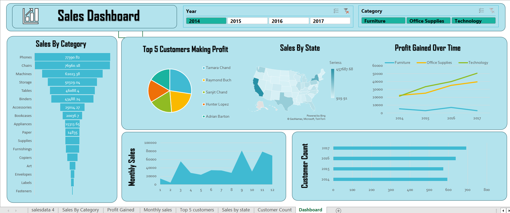

# Excel-Sales-Dashboard
# Microfinance-Loan-Insights-and-Visualizing-Lending-Patterns-Power-BI

## Table of Contents
- [Project Overview](#project-overview)
- [Data Sources](#data-sources)
- [Skills and Tools Used](#skills-and-tools-used)
- [Project Scope](#project-scope)
- [Results/Findings](#resultsfindings)

## Project Overview
This project involved designing a comprehensive sales dashboard in Excel to analyze sales performance across various dimensions, including product categories, regions, sales representatives, and monthly trends. The dashboard enables a clear visualization of sales data, helping stakeholders make informed decisions based on performance metrics, trend analysis, and key insights.

## Data Sources
The primary dataset used for this analysis is the [sales_dataset](https://docs.google.com/spreadsheets/d/1PH5Sl91k2qrAqO9NoKlkvBKsdM8YN9ZF/edit?usp=drive_link&ouid=110938831569867299215&rtpof=true&sd=true) file, containing detailed information about each sales data given by the company.
The data used in this project was synthetic but realistic, consisting of 1,500 rows simulating one year of sales data.
**Key data points included:**
* **Order ID:** Unique identifier for each sale
* **Date:** Randomly generated dates within one year
* **Product Category and Product Name:** Varied products under five main categories (Electronics, Apparel, Groceries, Home Goods, Sports)
* **Region and Sales Representative:** Geographic and personnel information for each sale
Units Sold, Price per Unit
* **Total Sales:** Quantity and financial details for calculating total revenue

## Skills and Tools Used
**Skills:**
* Data Cleaning
* Data Aggregation
* Data Visualization
* Business Analysis
* Trend Analysis
* Report Building
* Performance Analysis

**Excel Tools:**
* **Data Cleaning:** Used data validation, duplicate removal, and formatting
* **Pivot Tables:** Aggregated data for easy slicing by category, region, and time
* **Formulas:** SUMIF, COUNTIF, AVERAGEIF, and IF functions for calculations and metrics
* **Charts:** Created a range of charts (pie, line, bar, stacked column, and area) for a visually informative dashboard
* **Slicers and Filters:** Added interactive slicers for user-friendly data exploration
  
## Project Scope
* **Data Preparation:** Generated, cleaned, and structured data in Excel for seamless analysis.
* **Metric Development:** Identified and calculated key sales metrics such as total sales, average sales per order, and sales breakdown by region and representative.
* **Data Analysis:** Created pivot tables to analyze data from multiple perspectives.
* **Dashboard Design:** Developed an interactive dashboard featuring five main charts (pie chart, line chart, bar chart, stacked column chart, and area chart) to highlight top trends and insights.
* **Interactivity**: Enhanced usability with drop-down menus, slicers, and conditional formatting to support in-depth exploration of data.
## Results/Findings
* **Top Performing Category:** Electronics emerged as the top-selling category, contributing significantly to total revenue.
* **Sales Trends:** Monthly trend analysis showed strong seasonal demand spikes in December and significant growth in the first quarter.
* **Regional Performance:** The North and West regions demonstrated the highest sales, suggesting targeted strategies could further capitalize on these markets.
* **Top Sales Representatives:** Charlie and Diana led in sales volume, indicating effective sales strategies and potential candidates for training or leadership roles.
* **Growth Patterns:** The area chart analysis revealed an upward growth trend, with a consistent increase in sales over the year.
